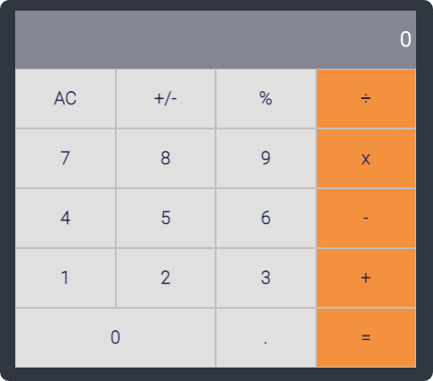

<br />
<p align="center">
  <a href="https://github.com/chuckbuckethead/microverse-math-magicians">
    
  </a>

  <h3 align="center">Math Magicians</h3>

  <p align="center">
    This project is part of the Microverse React Module.
    <br />
    <a href="https://github.com/chuckbuckethead/microverse-math-magicians/issues">Report Bug</a>
    ·
    <a href="https://github.com/chuckbuckethead/microverse-math-magicians/issues">Request Feature</a>
  </p>
</p>

> A simple Calculator app built with React

## Getting Started

### Prerequisites

- [Node >= 10.16](https://nodejs.org/en/)

### Setup

* Clone this repository
```
git clone https://github.com/crgc/microverse-math-magicians.git
```
* Change into folder
```
cd microverse-math-magicians
```
* Install dependencies
```
npm install
```

### Run
* Start dev server
```
npm start
```
* Open your browser at http://localhost:3000/

## Built With

- React
- HTML5 & CSS3

## Authors

👤  **Carlos González**
- GitHub: [@crgc](https://github.com/crgc)
- Twitter: [@aclerkofpomier](https://twitter.com/aclerkofpomier)
- LinkedIn: [Carlos González](https://www.linkedin.com/in/carlosrmgonzalez/)

## Show your support

Give a ⭐️ if you like this project!

## Acknowledgments

- Microverse

## 📝 License

This project is [MIT](https://www.mit.edu/~amini/LICENSE.md) licensed.